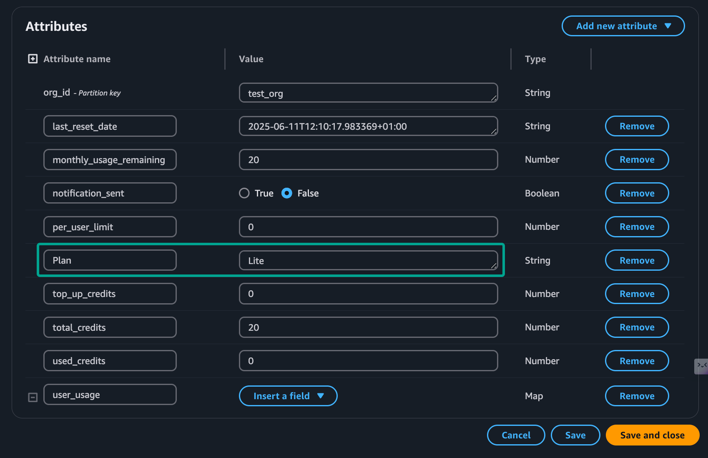
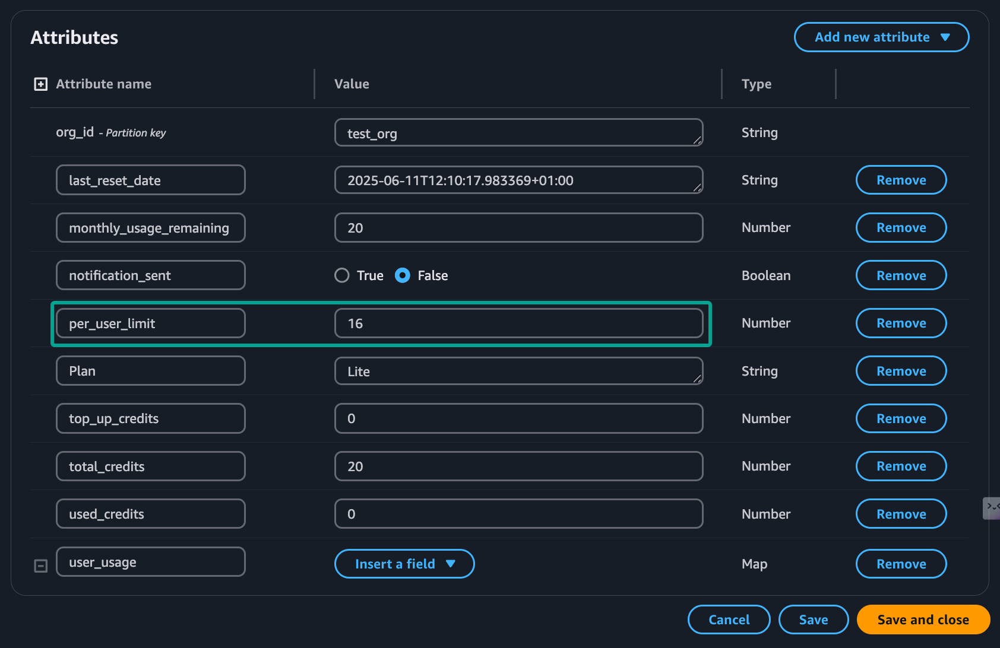
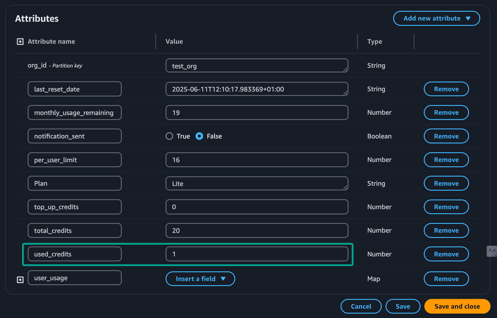
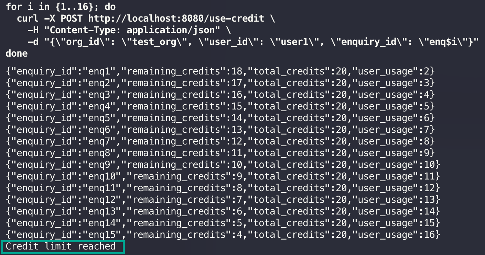
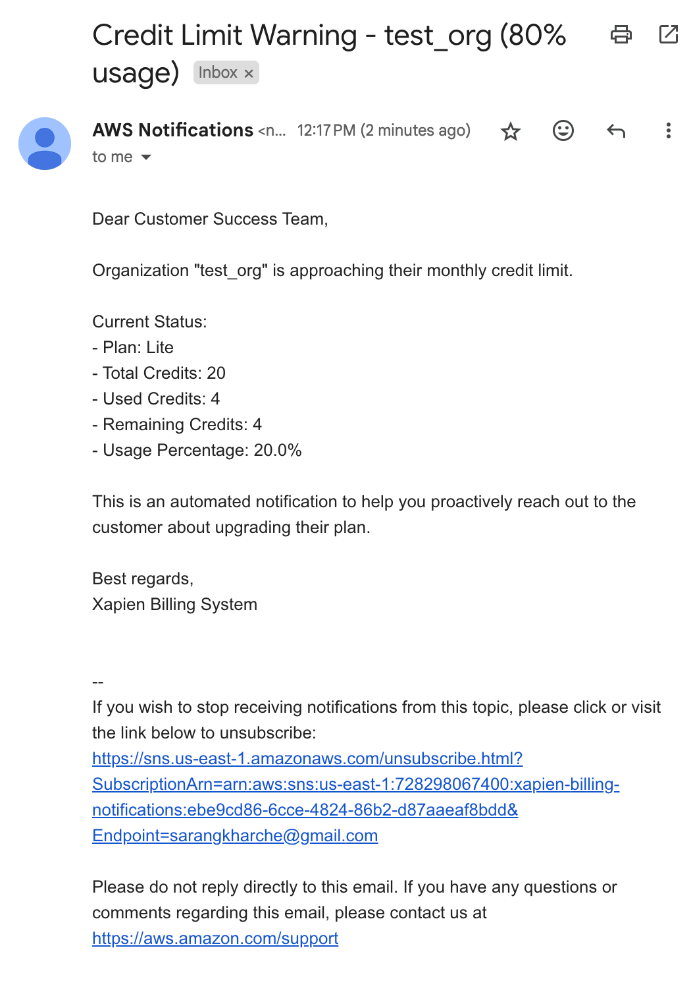
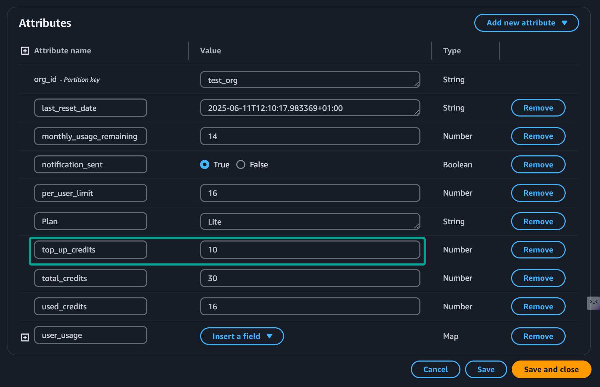

## Xapien Billing System

### Summary:

This project is built for **Take Home Assignment with Xapien - Senior Platform Engineer**.
I used Go as the programming language, AWS DynamoDB as the database and AWS SNS as the notification service.
I utilised AI to refactor code and improve the code quality. Whilst the recommended hours to spend on this project was 4 hours, I probably spent 7-8 hours since after the initial setup, I got very interested in improving code and adding new features. I've added screenshots of business logic testing, the API endpoints test using CURL and AWS SNS notification.

*Note: Please ensure you have the following installed and configured:*

- GO 1.21 or higher
- AWS CLI configured with appropriate credentials

### How to Run:

1. clone the repo
2. run `go run cmd/server/main.go`
3. cd to `infra` and run `terraform init` and `terraform apply`
4. export the following environment variables:
```bash
export SNS_TOPIC_ARN="arn:aws:sns:us-east-1:<your-account-id>:xapien-billing-notifications"
```
5. cd to `cmd/server` and run `go run main.go`


### Project Structure:


```cmd/server``` - Application entry point

```internal/domain``` - Domain models and business logic

```internal/repository``` - Data access layer (DynamoDB)

```internal/transport``` - HTTP handlers and routing

```internal/usecase``` - Application use cases

```config``` - Configuration management

```pkg``` - Shared utilities


### How to Test:

#### 1. Set Plan
```bash
curl -X POST http://localhost:8080/set-plan \
  -H "Content-Type: application/json" \
  -d '{"org_id": "test_org", "plan": "Lite"}'
```


#### 2. Set Per-User Limit
```bash
curl -X POST http://localhost:8080/set-user-limit \
  -H "Content-Type: application/json" \
  -d '{"org_id": "test_org", "limit": 16}'
```


#### 3. Use Report Credit
```bash
curl -X POST http://localhost:8080/use-credit \
  -H "Content-Type: application/json" \
  -d '{"org_id": "test_org", "user_id": "user1", "enquiry_id": "enq1"}'
```


```bash
for i in {1..16}; do
  curl -X POST http://localhost:8080/use-credit \
    -H "Content-Type: application/json" \
    -d "{\"org_id\": \"test_org\", \"user_id\": \"user1\", \"enquiry_id\": \"enq$i\"}"
done
```


AWS SNS Email Notification:


#### 4. Top Up Customer Account
```bash
curl -X POST http://localhost:8080/top-up \
  -H "Content-Type: application/json" \
  -d '{"org_id": "test_org", "credits": 10}'
```



### Key Components:

1. **Domain Layer** (`internal/domain/`)
   - Core business entities (Organisation, Plan, etc.)
   - Business rules and validations
   - Credit management logic

2. **Repository Layer** (`internal/repository/`)
   - DynamoDB integration
   - Data persistence operations
   - Error handling and retries

3. **Use Case Layer** (`internal/usecase/`)
   - Business operations implementation
   - Credit usage tracking
   - Notification triggers

4. **Transport Layer** (`internal/transport/`)
   - HTTP handlers
   - Request/Response handling
   - Input validation

### Features:

### 1. Plan Management
- Supports multiple plan types:
  - Ultimate: 1000 reports/month
  - Enterprise: 500 reports/month
  - Basic: 100 reports/month
  - Lite: 20 reports/month
  - Trial: 10 reports total

### 2. Credit Tracking
- Per-organization credit limits
- Per-user credit limits
- Monthly credit reset
- Credit usage tracking
- Top-up functionality

### 3. Notifications
- 80% usage warning notifications
- 100% usage limit notifications

### 4. API Endpoints

```Set Plan```

```Set User Limit```

```Use Credit```

```Top Up```

### AWS Setup:

#### DynamoDB
- Table: `xapien-billing`
- Primary Key: `org_id` (String)
- Attributes:
  - `plan`: Organization's plan type
  - `monthly_usage`: Current month's usage
  - `user_usage`: Per-user usage tracking
  - `per_user_limit`: User-specific limits
  - `top_up_credits`: Additional credits
  - `last_reset_date`: Last monthly reset
  - `notification_sent`: Notification state

#### SNS
- Topic: `xapien-billing-notifications`
- ARN: `arn:aws:sns:us-east-1:728298067400:xapien-billing-notifications`
- Email subscriptions for notifications

### Design Decisions:

#### 1. Domain-Driven Design
- Clear separation of concerns
- Rich domain models
- Business logic encapsulation

#### 3. AWS Services Choice
- **DynamoDB**: For storing the data
- **SNS**: For sending notifications

#### 4. Error Handling
- Meaningful error messages
- Logging for debugging
